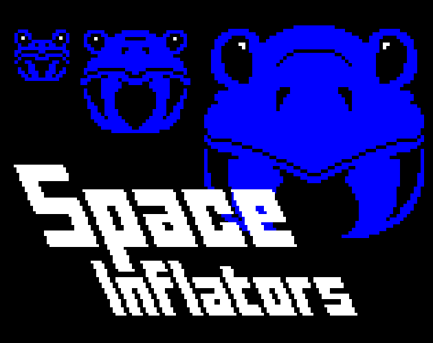

# Space Inflators

This game was originally made for the GMTK Game Jam 2024 under 96 hours. This is the first time I ever participated in a game jam. Despite the game's scope being small, It was still very stressful to make on a time limit, but I managed to make the game adhere to (most of) my vision in the end. I learned a lot from this experience and I'm very happy I participated in the jam!

# Compiling Guide

1) Install [GameMaker Studio 2](https://gamemaker.io/en/download) on your computer.
2) Open GameMaker and go to `File > Preferences > Runtime Feeds > Master` and make sure runtime version `2023.11.1.160` is installed and running.
3) Go back to the `Start Page`, press `Open` and navigate to `source/Space_Inflators.yyp` from this repository in the pop-up file explorer.
4) The game's source code is now open in GameMaker. Go to the top-right corner of the window, press the `Targets` button and choose your preferred target to compile to or the right target for your computer.
5) Press the `Run` button or `F5` to compile and test the game quickly. Press the `Create Executable` button or `Ctrl + F8` to compile the game into an executable which is compatible with your chosen target.

# Music and Font Asset Sources

Title Theme - "8 Bit Nostalgia" by David Renda

Main Font - Arcade Classic Font by Jakob "Pizzadude" Fischer (not on HTML5)

Title Font - FFF Forward Font by "Fonts For Flash"
